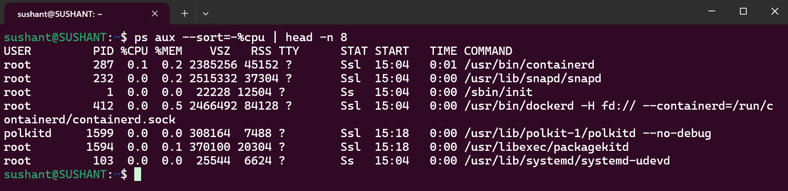
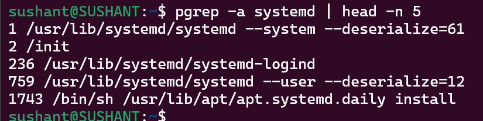
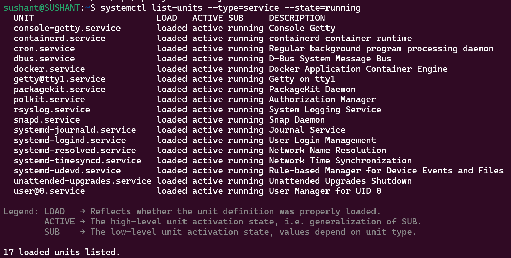
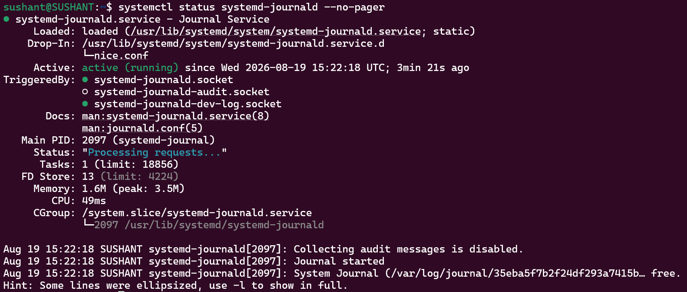
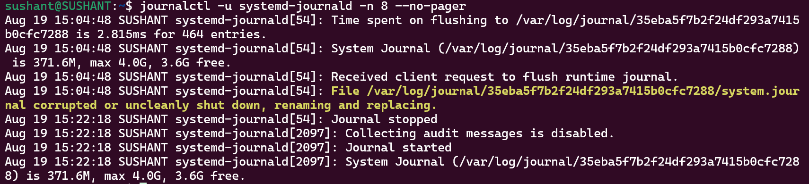

# Linux Practice
 
## Process Checks

### 1. ps aux --sort=-%cpu | head -n 8
Lists processes and shows the highest CPU consumers first.

### 2. pgrep -a systemd | head -n 5
Finds running processes whose command matches systemd.

## Service Checks

### 3. systemctl list-units --type=service --state=running 
Shows a sample of currently running systemd services.

### 4. systemctl status systemd-journald --no-pager
Inspects the selected systemd-journald service, including its active state and recent service information.

## Log Checks

### 5. journalctl -u systemd-journald -n 8 --no-pager
Displays the latest eight journal entries associated with systemd-journald.

## Sample Troubleshooting Flow

When a Linux service or application is reported as unhealthy:

1. Check the process: ps aux or pgrep
2. Check the service: systemctl status <service>
3. Inspect recent logs: journalctl -u <service> -n 50 --no-pager
4. Check system-level warnings: journalctl -b -p warning
5. Identify the cause, then restart or correct the configuration only after understanding the failure.

The key habit is to move from process → service → logs → root cause, rather than restarting a service blindly.
