# Linux Troubleshoot Runbook


## Environment Basics

### 1. uname -a

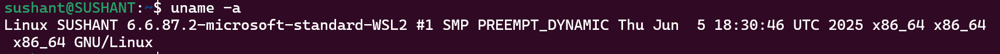


Observation: The command confirms the kernel, host architecture, and operating-system kernel build.

### 2. cat /etc/os-release

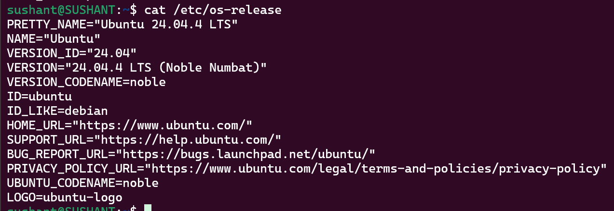


My Observation: The command helps to identify the Linux distribution and release information.

## Filesystem Sanity

### 3. Create a throwaway test file

```bash
 mkdir -p /tmp/runbook-demo && printf 'Linux troubleshooting drill\n' > /tmp/runbook-demo/demo.txt && ls -l /tmp/runbook-demo
```

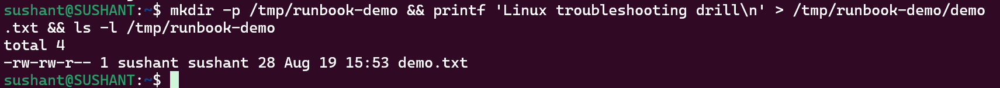

Observation: The temporary directory and test file were created successfully, confirming basic filesystem write access.

### 4. Copy and verify `/etc/hosts`

```text
$ cp /etc/hosts /tmp/runbook-demo/hosts-copy && ls -l /tmp/runbook-demo/hosts-copy
-rw-r--r-- 1 oai oai 174 Aug 19 15:31 /tmp/runbook-demo/hosts-copy
```

Observation: The file copy completed successfully, confirming read/write access and available space in /tmp.

## CPU / Memory Snapshot

### 5. Check the target process

```bash
ps -o pid,pcpu,pmem,comm -C systemd-journald
```
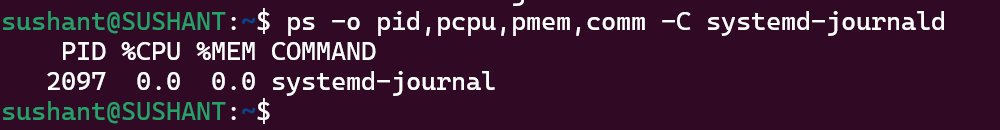

Observation: This shows the target process's PID plus current CPU and memory percentages. Low usage indicates no obvious resource spike.

### 6. Check memory

```bash
free -h
```
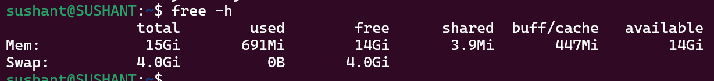

Observation: This command is used to check available RAM and swap before blaming the service for memory-related symptoms.

## Disk / I/O Snapshot

### 7. Check root filesystem

```bash
df -h /
```

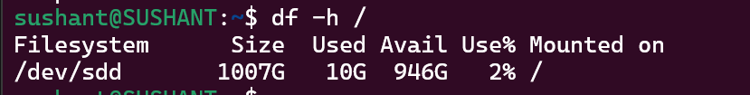

Observation: This confirms filesystem capacity and helps identify a full root filesystem as a possible cause of service failures.

### 8. Check system activity

```bash
vmstat 1 2
```

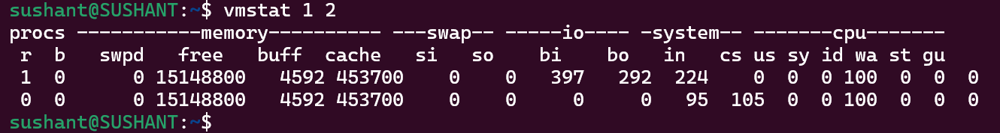

Observation: This provides a quick view of CPU, memory, paging, and I/O activity. No single metric should be treated as a root cause by itself.

## Network Snapshot

### 9. Check listening sockets

```bash
ss -tulpn | head -n 12
```

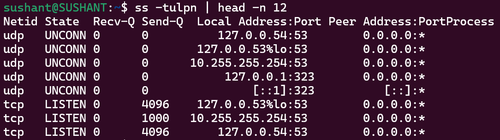

Observation: This shows listening TCP/UDP sockets and helps identify whether expected services are bound to ports.

### 10. Test local HTTP connectivity

```bash
curl -I --max-time 5 http://127.0.0.1:80
```

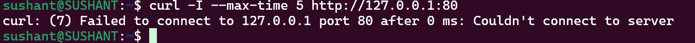

Observation: A connection refusal or timeout would indicate that nothing is serving HTTP on the local port; this does not directly indicate a journald failure.

## Service & Logs

### 11. Inspect systemd-journald

```bash
systemctl status systemd-journald --no-pager
```

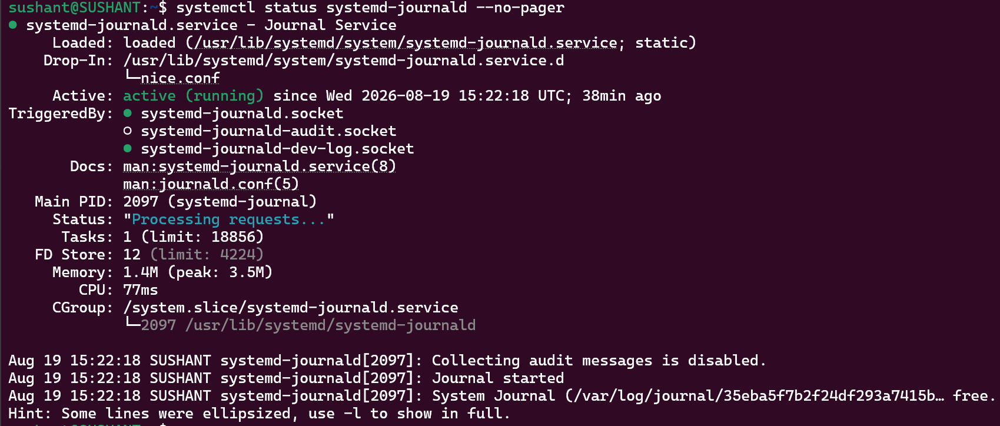

Observation: This confirms whether the target service is active and provides recent service state information.

### 12. Review recent journal entries

```bash
journalctl -u systemd-journald -n 20 --no-pager
```
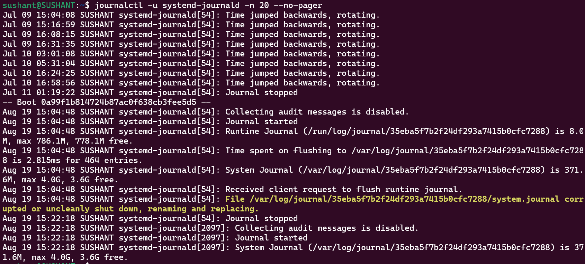

Observation: Reviews recent service-related messages for warnings, errors, restarts, or other unusual behavior.

## My Basic Findings

The drill follows a repeatable sequence: environment → filesystem → CPU/memory → disk/I/O → network → service → logs. The collected snapshots provide enough context to decide whether the issue is likely application/service-related or caused by a broader system resource problem.
