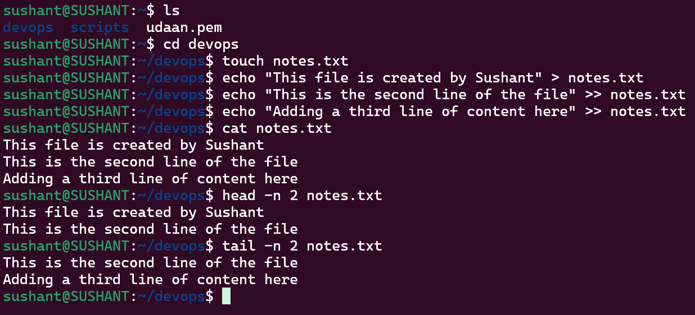

# File I/O Practice

## Creation of file
`touch notes.txt` creates an empty file.

## Write and Append

- echo "This file is created by Sushant" > notes.txt will write text in the file
- echo "This is the second line of the file" >> notes.txt will append to the file
- echo "Adding a third line of content here" >> notes.txt will append to the file
- `>` writes Line 1 and replaces existing content.
- `>>` appends Line 2 without overwriting Line 1.
- `tee -a` appends Line 3 and displays it immediately.

## Read
- `cat notes.txt` reads the complete file.
- `head -n 2 notes.txt` reads the first two lines.
- `tail -n 2 notes.txt` reads the last two lines.

- Result
The exercise demonstrates the basic Linux flow: create → write → append → read.
