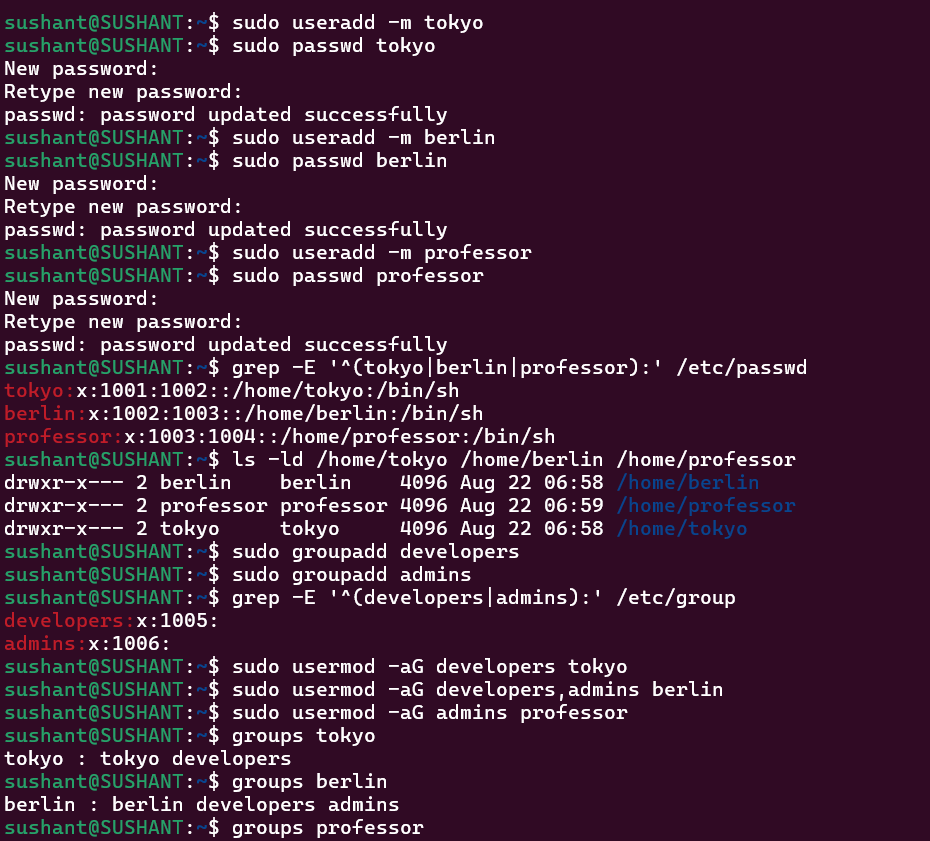
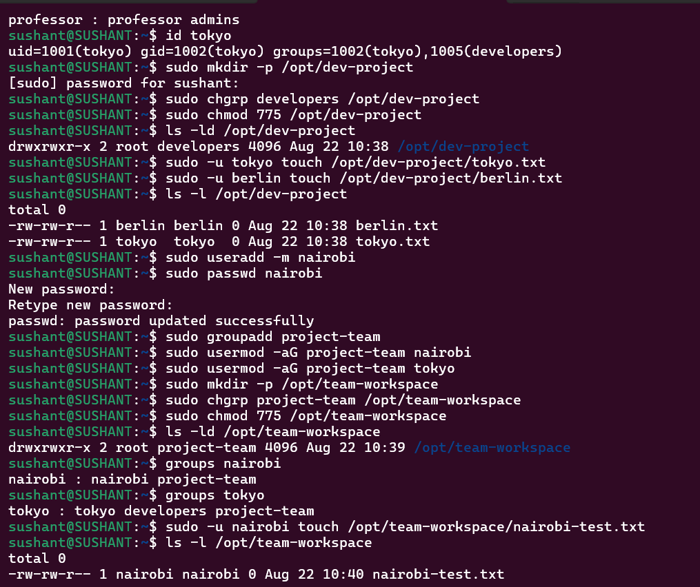

# Day 09 — Linux User & Group Management

## Objective

Practice creating users, managing groups, configuring shared directories, and verifying Linux permissions.

Running these commands on a practice VM/EC2 instance with sudo access. Set passwords interactively with passwd; do not place real passwords in scripts or documentation.

## Task 1 — Create Users

```bash
sudo useradd -m tokyo
sudo passwd tokyo

sudo useradd -m berlin
sudo passwd berlin

sudo useradd -m professor
sudo passwd professor
```

Verifying the users creation:

```bash
grep -E '^(tokyo|berlin|professor):' /etc/passwd
ls -ld /home/tokyo /home/berlin /home/professor
```

## Task 2 — Creating Groups

```bash
sudo groupadd developers
sudo groupadd admins
```

Verifying the groups:

```bash
grep -E '^(developers|admins):' /etc/group
```

## Task 3 — Assign Users to Groups

```bash
sudo usermod -aG developers tokyo
sudo usermod -aG developers,admins berlin
sudo usermod -aG admins professor
```

Verify:

```bash
groups tokyo
groups berlin
groups professor

id tokyo
id berlin
id professor
```

Important: -aG appends supplementary groups. Do not omit -a, or existing supplementary group memberships can be replaced.

## Task 4 — Shared Developer Directory

```bash
sudo mkdir -p /opt/dev-project
sudo chgrp developers /opt/dev-project
sudo chmod 775 /opt/dev-project
```

Verify:

```bash
ls -ld /opt/dev-project
```

Expected permission pattern:

```text
drwxrwxr-x
```

Test as `tokyo` and `berlin`:

```bash
sudo -u tokyo touch /opt/dev-project/tokyo.txt
sudo -u berlin touch /opt/dev-project/berlin.txt
ls -l /opt/dev-project
```

## Task 5 — Team Workspace

```bash
sudo useradd -m nairobi
sudo passwd nairobi

sudo groupadd project-team

sudo usermod -aG project-team nairobi
sudo usermod -aG project-team tokyo

sudo mkdir -p /opt/team-workspace
sudo chgrp project-team /opt/team-workspace
sudo chmod 775 /opt/team-workspace
```

Verify:

```bash
ls -ld /opt/team-workspace
groups nairobi
groups tokyo
```

Test:

```bash
sudo -u nairobi touch /opt/team-workspace/nairobi-test.txt
ls -l /opt/team-workspace
```

## Troubleshooting Checks

If a user cannot create a file:

```bash
ls -ld /opt/dev-project
id tokyo
id berlin
```

For `775`, the permission model is:

```text
owner → rwx
group → rwx
others → r-x
```

If a newly added group does not appear in an existing login session, start a new login session:

```bash
su - tokyo
groups
```






## Command Summary

```text
useradd -m   → create user with home directory
passwd       → set/change password
groupadd     → create group
usermod -aG  → add user to supplementary group
id           → inspect UID/GID and groups
groups       → display group membership
chgrp        → change group ownership
chmod        → change permissions
ls -ld       → inspect directory permissions
sudo -u      → run a command as another user
```

## Key Learning

Create user → Create group → Assign membership → Configure ownership → Set permissions → Test as user → Verify

For production systems, apply least privilege and avoid granting broader permissions than the role requires.
