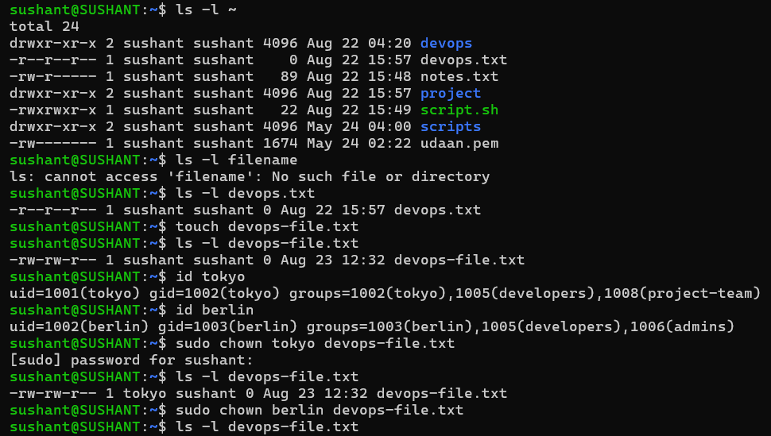
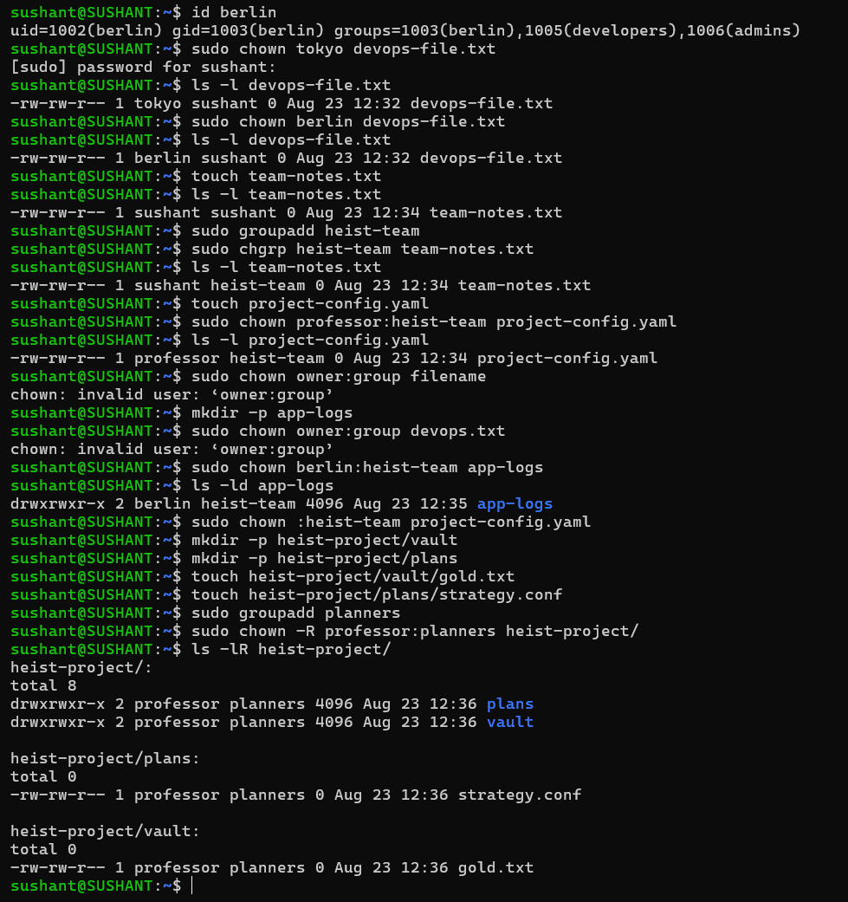

# Day 11 — Linux File Ownership

## Objective

Understand how Linux manages **file ownership**, change the owner and group using `chown` and `chgrp`, and apply ownership changes recursively to directories.

Run these commands on a practice VM or EC2 instance with `sudo` access. The user and group must exist before assigning ownership.

## Task 1 — Understanding Ownership

Check your home directory:

```bash
ls -l ~
```

### The important fields are:

- Owner: The user account that owns the file.
- Group: The group associated with the file.
- Permissions: Determine what the owner, group members, and others can do with the file.

Check a specific file:
```bash
ls -l filename
```

## Owner vs Group

The owner is a specific Linux user. The group allows multiple users to share access to a file or directory according to the assigned permission bits.

## Task 2 — Basic chown Operations

Create the practice file:
```bash
touch devops-file.txt
```

Check its current ownership:
```bash
ls -l devops-file.txt
```

Make sure the users exist:

```bash
id tokyo
id berlin
```
If they do not exist:
```bash
sudo useradd -m tokyo
sudo useradd -m berlin
```

Change the owner to tokyo:
```bash
sudo chown tokyo devops-file.txt
```
Verify:
```bash
ls -l devops-file.txt
```
Change the owner to berlin:
```bash
sudo chown berlin devops-file.txt
```

Verify again:

```bash
ls -l devops-file.txt
```

## What I Learned? 

chown username filename changes the owner of a file without changing its group.


## Task 3 — Basic chgrp Operations

### Create the file:
```bash
touch team-notes.txt
```

### Check its current group:
```bash
ls -l team-notes.txt
```

### Create the group:
```bash
sudo groupadd heist-team
```

### Change the file's group:
```bash
sudo chgrp heist-team team-notes.txt
```

### Verify:

```bash
ls -l team-notes.txt
```
## What I Learned?

chgrp groupname filename changes only the group ownership of a file.

## Task 4 — Change Owner and Group Together

### Create the configuration file:
```bash
touch project-config.yaml
```

### Change both the owner and group:
```bash
sudo chown professor:heist-team project-config.yaml
```
### Verify:
```bash
ls -l project-config.yaml
```
The syntax is:
```bash
sudo chown owner:group filename
```
Create the application log directory:
```bash
mkdir -p app-logs
```
Change its owner to berlin and group to heist-team:
```bash
sudo chown berlin:heist-team app-logs
```
Verify:
```bash
ls -ld app-logs
```
You can also change only the group using chown:
```bash
sudo chown :heist-team project-config.yaml
```
## Task 5 — Recursive Ownership

Create the directory structure:
```bash
mkdir -p heist-project/vault
mkdir -p heist-project/plans

touch heist-project/vault/gold.txt
touch heist-project/plans/strategy.conf
```
### Create the group:
```bash
sudo groupadd planners
```
Change the owner and group recursively:
```bash
sudo chown -R professor:planners heist-project/
```
Verify all files and directories:
```bash
ls -lR heist-project/
```



What I Learned

The -R option means recursive. It applies the ownership change to the target directory and everything underneath it.

This is useful when an application directory contains multiple files and subdirectories that need consistent ownership.

## Task 6 — Practice Challenge

### Create the users if they do not already exist:
```bash
id tokyo || sudo useradd -m tokyo
id berlin || sudo useradd -m berlin
id nairobi || sudo useradd -m nairobi
```
### Create the groups:
```bash
sudo groupadd vault-team
sudo groupadd tech-team
```
### If a group already exists, check it with:

```bash
getent group vault-team
getent group tech-team
```
Create the project directory:
```bash
mkdir -p bank-heist
```
### Create the three files:
```bash
touch bank-heist/access-codes.txt
touch bank-heist/blueprints.pdf
touch bank-heist/escape-plan.txt
```
### Set the requested ownership:
```bash
sudo chown tokyo:vault-team bank-heist/access-codes.txt

sudo chown berlin:tech-team bank-heist/blueprints.pdf

sudo chown nairobi:vault-team bank-heist/escape-plan.txt
```
Verify:
```bash
ls -l bank-heist/
```
### Expected ownership:

access-codes.txt   → tokyo    vault-team
blueprints.pdf     → berlin   tech-team
escape-plan.txt    → nairobi  vault-team