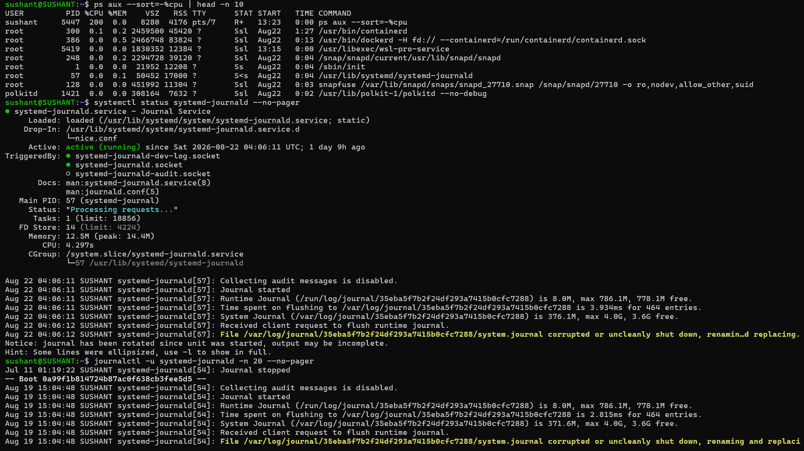
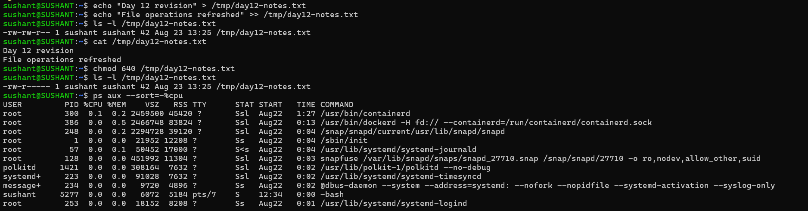

# Day 12 — Linux Revision

## Revision

- Consolidate Days 01–11 instead of learning a new topic.
- Revisit the 90-day plan: AWS + Docker/Kubernetes, CI/CD, Terraform, and Linux troubleshooting.
- Keep the learning cycle: Learn → Practice → Troubleshoot → Document → Repeat.
- Current priority: become stronger at diagnosing problems and implementing production-ready DevOps solutions.

## 1. Plan Checkpoint

- Goal 1: Deploy a containerized application on AWS using Docker and Kubernetes.
- Goal 2: Build a reliable CI/CD pipeline covering build, testing, scanning, secrets, and deployment.
- Goal 3: Improve AWS and Terraform skills across IAM, networking, infrastructure, monitoring, and cost awareness.
- Adjustment: Keep Linux troubleshooting as the foundation because it supports every later DevOps task.

## 2. Processes & Services

### Process check

```bash
ps aux --sort=-%cpu | head -n 10
```

Observation: This identifies processes currently consuming the most CPU and gives me a PID for deeper investigation.

### Service check

```bash
systemctl status systemd-journald --no-pager
```

Observation: This confirms whether the selected systemd service is active and provides recent service information.

### Log check

```bash
journalctl -u systemd-journald -n 20 --no-pager
```

Observation: This filters journal entries for one service, making it easier to investigate service-specific problems.



## 3. File Skills

### Append data

```bash
echo "Day 12 revision" > /tmp/day12-notes.txt
echo "File operations refreshed" >> /tmp/day12-notes.txt
```

### Verify

```bash
ls -l /tmp/day12-notes.txt
cat /tmp/day12-notes.txt
```

Observation: `>` writes or overwrites a file, while `>>` appends data without removing existing content.

### Change permissions

```bash
chmod 640 /tmp/day12-notes.txt
ls -l /tmp/day12-notes.txt
```


Observation: 640` gives the owner read/write, the group read, and others no access.

## 4. Five Commands I Would Reach for First

- ps aux --sort=-%cpu — identify CPU-heavy processes.
- systemctl status <service> — check service state.
- journalctl -u <service> — investigate service logs.
- df -h — check disk capacity.
- ls -l — inspect permissions and ownership.

These commands provide a quick first-pass view of processes, services, logs, storage, and access.

## 5. User / Group & Ownership Checkpoint

```bash
ls -l /tmp/day12-notes.txt
```

Observation: `ls -l` shows permissions, owner, group, size, and timestamp. This connects the user/group and ownership practice from Days 09–11.

## 6. Mini Self-Check

### 1. Which 3 commands save me the most time right now, and why?

- `systemctl status` — quickly shows whether a service is running or failed.
- `journalctl` — provides evidence behind service failures.
- `ps` — helps identify processes consuming CPU or memory.

### 2. How do I check if a service is healthy?

My first checks would be:

```bash
systemctl status <service>
systemctl is-active <service>
journalctl -u <service> -n 50 --no-pager
```

This gives me the service state followed by recent logs.

### 3. How do I safely change ownership and permissions?

First inspect:

```bash
ls -l file.txt
```

Then make the smallest required change:

```bash
sudo chown user:group file.txt
sudo chmod 640 file.txt
```

Finally verify:

```bash
ls -l file.txt
```

The practical approach is inspect → change → verify.

### 4. What will I focus on improving in the next 3 days?

- Strengthen Linux troubleshooting, especially processes, services, logs, permissions, and networking.
- Practice AWS EC2 and networking with real deployments.
- Start connecting Linux fundamentals with Docker and CI/CD instead of treating each topic as an isolated command exercise.


