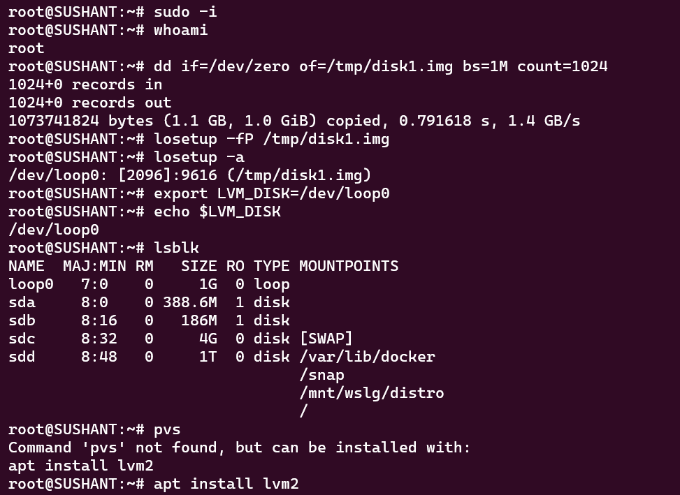
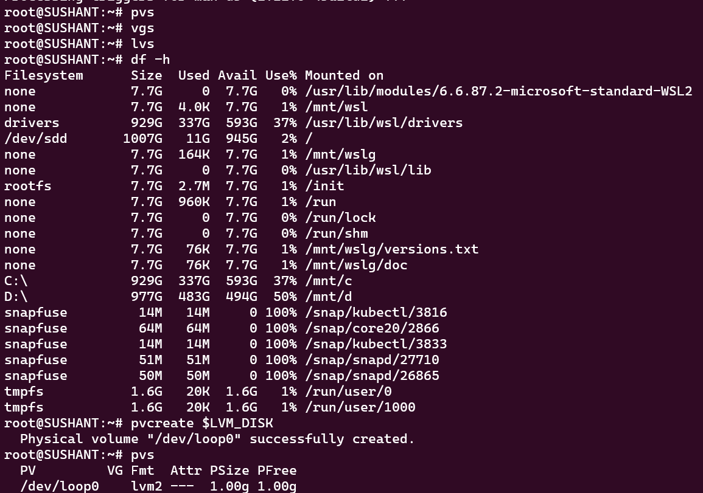
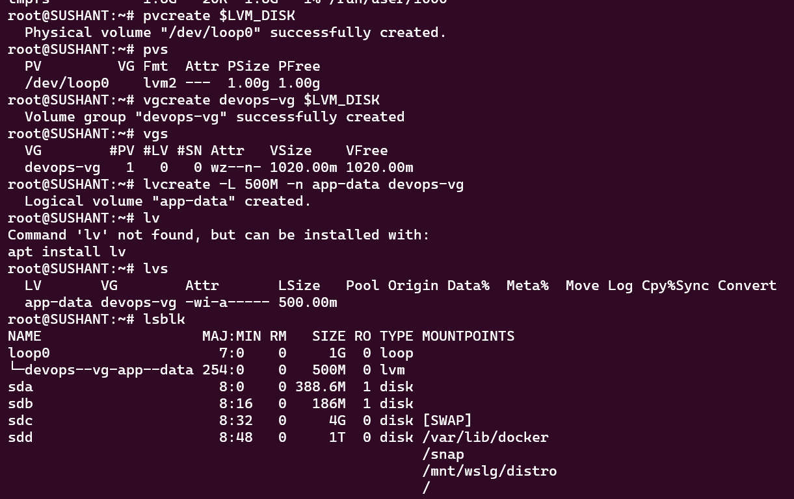
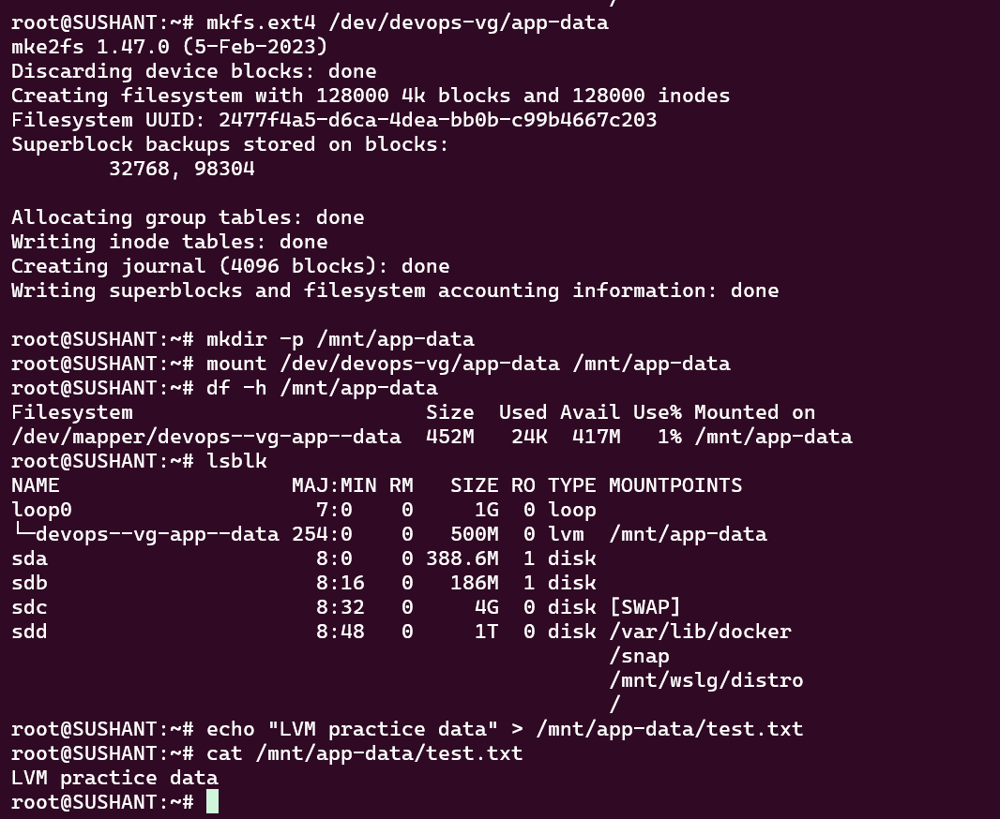
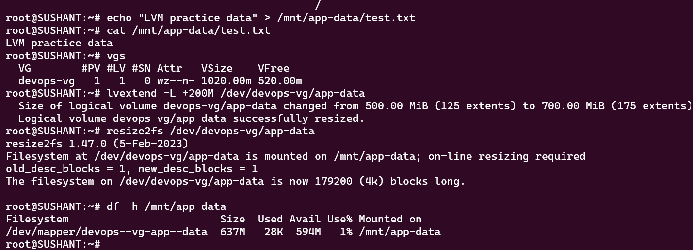

# Day 13 — Linux LVM Practice

## Objective

Learn the basic Linux Logical Volume Manager (LVM) workflow:

Disk → Physical Volume (PV) → Volume Group (VG) → Logical Volume (LV) → Filesystem → Mount → Extend

- Important: Do not run pvcreate, vgcreate, or mkfs against a disk containing important data. For this exercise, use a dedicated spare disk or a loop device created from a test image.

## Before You Start

Switch to root:

```bash
sudo -i
```

Verify:

```bash
whoami
```

Expected:

```text
root
```

svg in the original exercise appears to be a typo. It is not required for this LVM workflow.

### Create a Virtual Disk

If you do not have a spare disk, create a 1 GB disk image:

```bash
dd if=/dev/zero of=/tmp/disk1.img bs=1M count=1024
```

Attach it as a loop device:

```bash
losetup -fP /tmp/disk1.img
```

Find the assigned device:

```bash
losetup -a
```

Set the device variable to make the remaining commands easier:

```bash
export LVM_DISK=/dev/loop0
```

Verify:

```bash
echo $LVM_DISK
lsblk
```

Replace /dev/loop0 with the actual loop device shown on your system.

## Task 1 — Check Current Storage

Run:

```bash
lsblk
```

Purpose: Displays disks, partitions, and mounted devices.

Check existing physical volumes:

```bash
pvs
```

Check volume groups:

```bash
vgs
```

Check logical volumes:

```bash
lvs
```

Check mounted filesystem usage:

```bash
df -h
```

### Checkpoint

Before creating anything, confirm that your test disk/loop device is the device you intend to use.



## Task 2 — Create a Physical Volume

Create the LVM physical volume:

```bash
pvcreate $LVM_DISK
```

Verify:

```bash
pvs
```

You should see your test device listed as a physical volume.



### What I Learned

A Physical Volume (PV) is the storage device that LVM can use as the foundation for a volume group.

## Task 3 — Create a Volume Group

Create a volume group named devops-vg:

```bash
vgcreate devops-vg $LVM_DISK
```

Verify:

```bash
vgs
```

### What I Learned

A Volume Group (VG) pools storage from one or more physical volumes and provides a storage pool from which logical volumes can be created.


## Task 4 — Create a Logical Volume

Create a 500 MB logical volume:

```bash
lvcreate -L 500M -n app-data devops-vg
```

Verify:

```bash
lvs
```

You can also inspect the device:

```bash
lsblk
```

### What I Learned

A Logical Volume (LV) is the virtual block device created from free space inside a volume group.

The application can use the LV much like a normal disk partition.

## Task 5 — Format and Mount the Logical Volume

Create an ext4 filesystem:

```bash
mkfs.ext4 /dev/devops-vg/app-data
```

Create a mount point:

```bash
mkdir -p /mnt/app-data
```

Mount the logical volume:

```bash
mount /dev/devops-vg/app-data /mnt/app-data
```

Verify:

```bash
df -h /mnt/app-data
```

Also verify:

```bash
lsblk
```

Test that the filesystem is writable:

```bash
echo "LVM practice data" > /mnt/app-data/test.txt
cat /mnt/app-data/test.txt
```

Check:

```bash
ls -lh /mnt/app-data
```

### What I Learned

Formatting creates a filesystem on the LV, while mounting makes that filesystem accessible through a directory in the Linux filesystem hierarchy.


## Task 6 — Extend the Logical Volume

First check the available space:

```bash
vgs
```

The original 1 GB test disk has approximately 500 MB remaining after creating the 500 MB LV, so there should be enough space for the requested 200 MB extension.

Extend the LV:

```bash
lvextend -L +200M /dev/devops-vg/app-data
```

Check the LV:

```bash
lvs
```

For an ext4 filesystem, expand the filesystem to use the newly allocated space:

```bash
resize2fs /dev/devops-vg/app-data
```

Verify the new capacity:

```bash
df -h /mnt/app-data
```

You can also run:

```bash
lsblk
```

### What I Learned

Increasing the LV size and increasing the filesystem size are **two separate operations**.

The practical flow is:

```text
lvextend
   ↓
resize2fs
   ↓
df -h
   ↓
Verify new filesystem capacity
```

## LVM Architecture

The complete structure from this exercise is:

```text
/dev/loop0
    │
    ▼
Physical Volume
    │
    ▼
devops-vg
Volume Group
    │
    ▼
app-data
Logical Volume
    │
    ▼
ext4 filesystem
    │
    ▼
/mnt/app-data
Mounted filesystem
```

## Key Commands

```bash
# Discover disks
lsblk

# Check physical volumes
pvs

# Check volume groups
vgs

# Check logical volumes
lvs

# Create physical volume
pvcreate /dev/loop0

# Create volume group
vgcreate devops-vg /dev/loop0

# Create logical volume
lvcreate -L 500M -n app-data devops-vg

# Create filesystem
mkfs.ext4 /dev/devops-vg/app-data

# Mount filesystem
mount /dev/devops-vg/app-data /mnt/app-data

# Extend logical volume
lvextend -L +200M /dev/devops-vg/app-data

# Extend ext4 filesystem
resize2fs /dev/devops-vg/app-data

# Check filesystem usage
df -h /mnt/app-data
```

## Troubleshooting Checkpoints

### If `pvcreate` says the device is already in use

Check:

```bash
lsblk
losetup -a
pvs
```

Make sure you are using the intended test device.

### If there is not enough space for `lvextend`

Check:

```bash
vgs
```

Look at the **VFree** value. The volume group must have enough unallocated space for the extension.

### If `df -h` does not show the increased size

Check:

```bash
lvs
```

Then expand the ext4 filesystem:

```bash
resize2fs /dev/devops-vg/app-data
```

Finally:

```bash
df -h /mnt/app-data
```

### If the mount fails

Check:

```bash
lsblk
mount | grep app-data
```

and verify that the filesystem was created:

```bash
blkid /dev/devops-vg/app-data
```

---

## What I Learned

* LVM abstracts storage into **PV → VG → LV**, making storage easier to manage and resize.
* A physical disk or loop device becomes a **Physical Volume** before LVM can use it.
* A **Volume Group** provides a pool of storage from which Logical Volumes are allocated.
* Extending an LV does not automatically mean the filesystem has expanded; the filesystem must also be resized.
* `pvs`, `vgs`, and `lvs` provide three different views of the LVM storage hierarchy.
* `df -h` verifies the filesystem's usable capacity, while `lvs` verifies the logical volume size.

## Final Troubleshooting Flow

When working with LVM, follow:

```text
lsblk
  ↓
pvs
  ↓
vgs
  ↓
lvs
  ↓
Filesystem
  ↓
Mount
  ↓
df -h
  ↓
Verify
```

For a capacity expansion:

```text
Check VG free space
        ↓
lvextend
        ↓
Resize filesystem
        ↓
df -h
        ↓
Verify
```

## Cleanup — Optional

If you created the LVM environment only for this practice, clean it up after completing your screenshots.

First unmount:

```bash
umount /mnt/app-data
```

Remove the logical volume:

```bash
lvremove /dev/devops-vg/app-data
```

Remove the volume group:

```bash
vgremove devops-vg
```

Remove the physical volume metadata:

```bash
pvremove $LVM_DISK
```

If using the loop device, detach it:

```bash
losetup -d $LVM_DISK
```

Remove the test image:

```bash
rm -f /tmp/disk1.img
```

Better not run the cleanup commands against a real production disk or an LVM volume containing important data.
