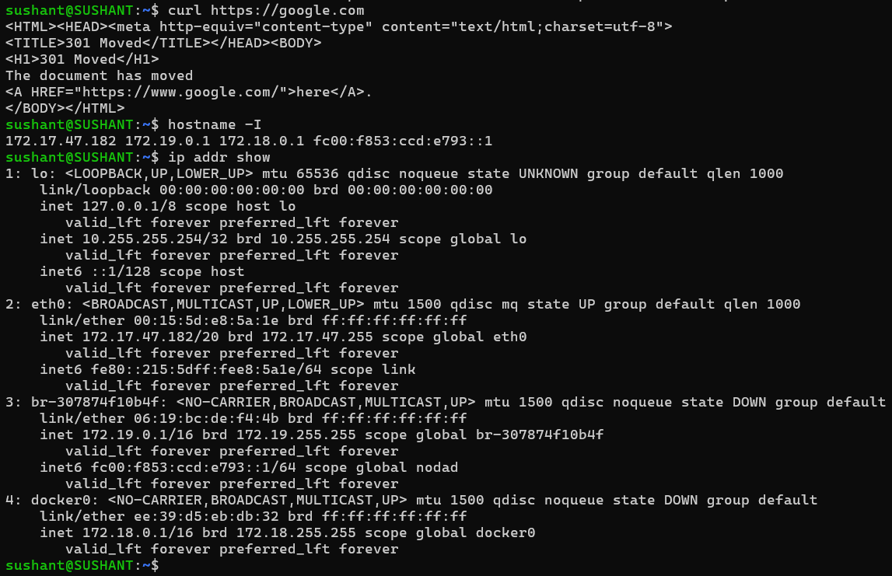
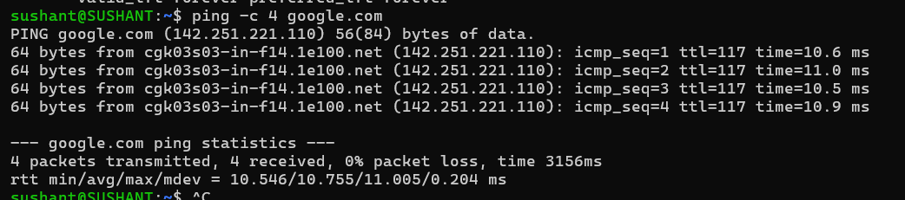
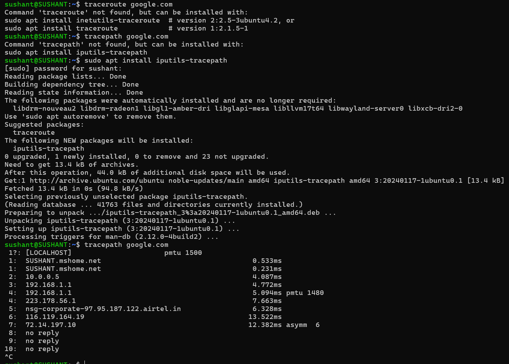
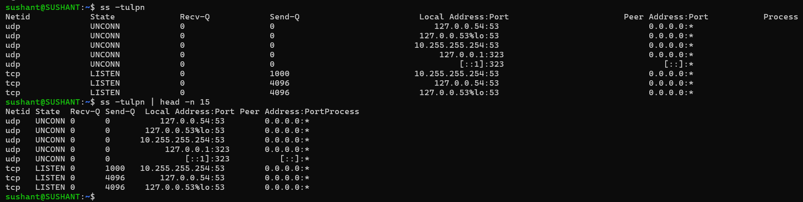
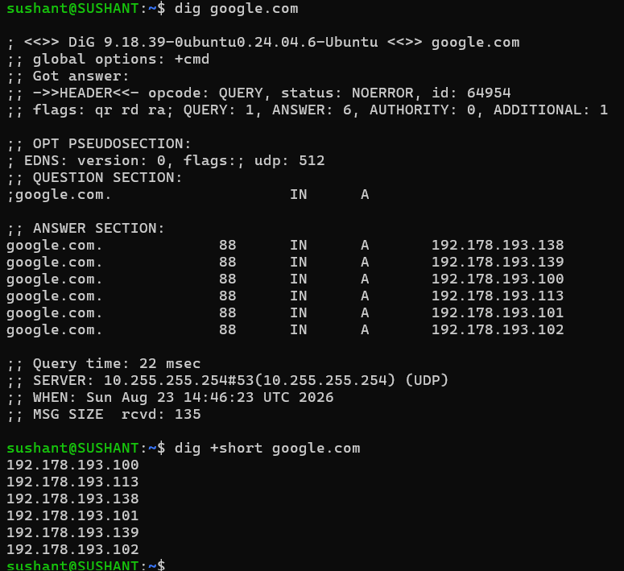
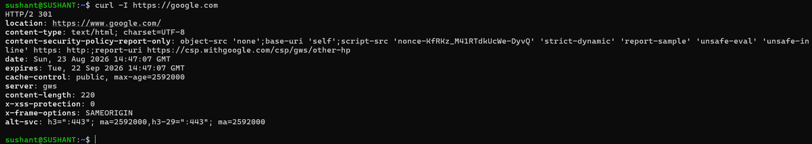
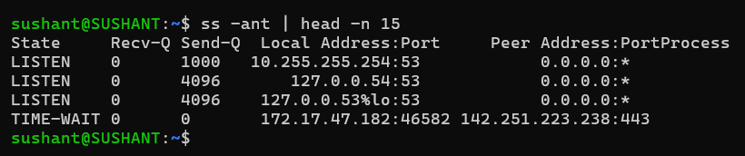
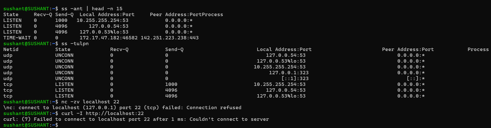

# Day 14 — Networking Fundamentals

## Objective

Understand the relationship between the OSI model and the TCP/IP model, then use basic Linux networking commands to perform a repeatable connectivity check.

Troubleshooting flow:

`Identity → Reachability → Path → Ports → DNS → HTTP → Connections`

---

## 1. OSI vs TCP/IP Models

| OSI | TCP/IP | What I Understand |
|---|---|---|
| L7 Application | Application | User-facing protocols such as HTTP, HTTPS, DNS, SSH. |
| L6 Presentation | Application | Data representation, encoding, encryption concepts such as TLS. |
| L5 Session | Application | Session establishment and management. |
| L4 Transport | Transport | TCP/UDP provide end-to-end transport. |
| L3 Network | Internet | IP provides addressing and routing between networks. |
| L2 Data Link | Link | Ethernet, MAC addressing, and local-network delivery. |
| L1 Physical | Link | Physical transmission of bits over cables, radio, or other media. |

### Important Protocols

- IP: L3 / Internet layer — provides logical addressing and routing.
- TCP: L4 / Transport — connection-oriented and reliable delivery.
- UDP: L4 / Transport — connectionless, lightweight delivery.
- HTTP/HTTPS: L7 / Application — web communication; HTTPS adds TLS protection.
- DNS: Application layer — translates domain names into IP addresses.

### Real Example

```bash
curl https://google.com
```

The application request uses HTTPS at the Application layer, runs over TCP at the Transport layer, and uses IP at the Internet layer. DNS may first resolve `google.com` to an IP address.


## 2. Target Host

For this practice, I use:

```text
Target: google.com
URL: https://google.com
```

## 3. Identity — Find My IP

Run:

```bash
hostname -I
```

Alternative:

```bash
ip addr show
```

### Observation

Record the IP address assigned to the machine. This identifies the local host/interface used for network communication.

My output:


---

## 4. Reachability — Ping

Run:

```bash
ping -c 4 google.com
```

### Observation

Check the number of packets transmitted/received, packet loss, and round-trip latency.

My output:


Interpretation: Zero packet loss with consistent latency indicates that ICMP replies are reaching the host. A failed ping does not automatically mean HTTP/HTTPS is unavailable because ICMP may be filtered.

---

## 5. Path — Traceroute

Run:

```bash
traceroute google.com
```

If `traceroute` is unavailable:

```bash
tracepath google.com
```

### Observation

Look for unusually long latency or repeated `* * *` timeouts.

My output:



Interpretation: A timeout on an individual hop does not necessarily indicate a failure; routers can intentionally suppress or rate-limit traceroute responses.


## 6. Ports — Listening Services

Run:

```bash
ss -tulpn
```

To make the output easier to read:

```bash
ss -tulpn | head -n 15
```

### Observation

Identify at least one listening service and its port.

My output:



Interpretation: A `LISTEN` socket indicates that a local process is waiting for incoming connections on that address/port.

## 7. Name Resolution — DNS

Run:

```bash
dig google.com
```

For only the resolved IP addresses:

```bash
dig +short google.com
```

### Observation

Recorded the returned IPv4/IPv6 address.



Interpretation: DNS resolution converts the hostname into an address that the client can use to establish the network connection. DNS is an Application-layer service.

## 8. HTTP/HTTPS Check

Run:

```bash
curl -I https://google.com
```

### Observation

Recorded the HTTP response status.

My output:



A successful web request normally produces a 2xx response, while redirects commonly produce 3xx responses. A 5xx response indicates a server-side failure. citeturn0search10


## 9. Connections Snapshot

Run:

```bash
ss -ant | head -n 15
```


### Observation

Count approximately how many connections are `ESTAB` versus `LISTEN`.

My output:



Interpretation: LISTEN represents sockets waiting for incoming connections, while ESTAB represents established TCP connections.


## 10. Mini Task — Port Probe

Identify a listening port from:

```bash
ss -tulpn
```

For example, if SSH is listening on port `22`:

```bash
nc -zv localhost 22
```

If `nc` is unavailable:

```bash
curl -I http://localhost:22
```

### My Test



### Interpretation

If the connection succeeds, the local port is reachable and a process is accepting connections.

If it fails, check:

```bash
systemctl status <service>
ss -tulpn | grep <port>
sudo ufw status
```

---

## 11. Mini Network Check

### Target

```text
google.com
```

### Check Sequence

```bash
hostname -I
ping -c 4 google.com
traceroute google.com
ss -tulpn
dig +short google.com
curl -I https://google.com
ss -ant | head
```

### Quick Findings

| Check | Result | Interpretation |
|---|---|---|
| Local IP | `[record output]` | Host identity confirmed |
| Ping | `[record latency/loss]` | Basic ICMP reachability |
| Traceroute | `[record result]` | Network path observed |
| Listening port | `[record port/service]` | Local service identified |
| DNS | `[record IP]` | Hostname resolved |
| HTTPS | `[record status]` | Application-level connectivity checked |
| Connections | `[record ESTAB/LISTEN]` | TCP state snapshot captured |

---

## 12. Reflection

### Which command gives me the fastest signal when something is broken?

`curl -I` is one of my fastest checks when troubleshooting a web service because it quickly tells me whether DNS, network connectivity, TCP/TLS, and the HTTP endpoint are working far enough to produce an HTTP response.

For a general network problem, I would first use:

```bash
ping -c 4 <target>
```

and then move deeper into the stack.

### What layer should I inspect next if DNS fails?

If DNS fails, I would investigate the Application layer first because DNS is an application-layer service. I would check:

```bash
dig google.com
cat /etc/resolv.conf
```

I would then try to  verify whether the configured DNS server is reachable.

### What if HTTP 500 appears?

An HTTP `500` means the request reached the application/server far enough to receive a server-side error. I would focus on the Application layer, especially application logs, service health, dependencies, and configuration.

For a web server:

```bash
systemctl status nginx
journalctl -u nginx -n 50 --no-pager
```

---

## 13. Two Follow-up Checks in a Real Incident

### Check 1 — Verify the service

```bash
systemctl status <service>
```

This determines whether the expected service is running or has failed.

### Check 2 — Inspect logs

```bash
journalctl -u <service> -n 50 --no-pager
```

This provides recent evidence about errors, restarts, configuration problems, or dependency failures.

For a web application, I would also check:

```bash
ss -tulpn | grep <port>
curl -v http://localhost:<port>
```

---

## Key Takeaways

- The OSI model is a seven-layer conceptual model, while TCP/IP groups networking functions into fewer practical layers.
- IP handles addressing/routing, while TCP/UDP handle transport.
- DNS resolves names, while HTTP/HTTPS handles web application communication.
- `ping`, `traceroute`, `ss`, `dig`, and `curl` test different parts of the connectivity path.
- A good network troubleshooting approach moves from basic connectivity toward the application layer instead of immediately assuming the application is broken.

## Practical Troubleshooting Flow

```text
My IP
  ↓
Can I reach the target?
  ↓
What path does traffic take?
  ↓
Are the required ports listening?
  ↓
Does DNS resolve?
  ↓
Does HTTP/HTTPS respond?
  ↓
What do service/application logs say?
```
