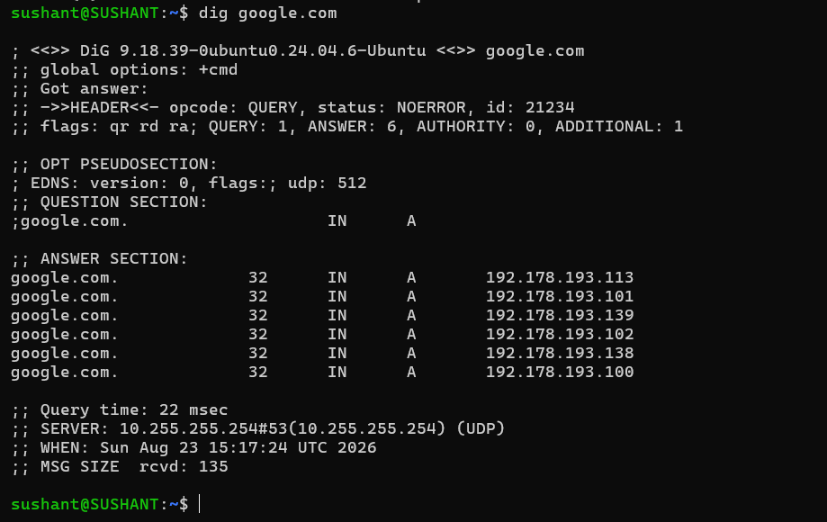
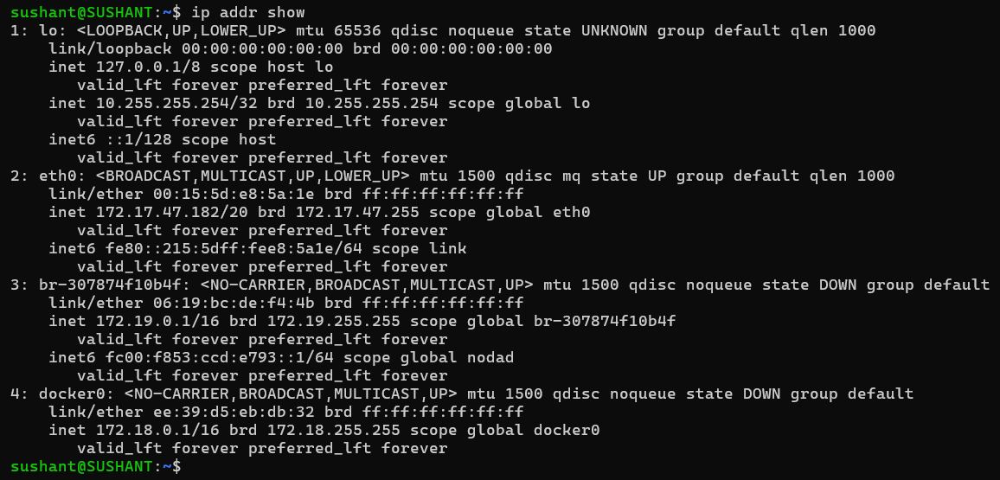
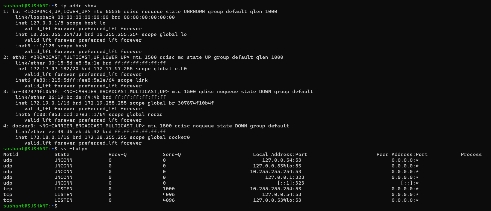

# Day 15 — Networking Concepts

## Task 1 — DNS: How Names Become IPs

When I type `google.com` into a browser, the system needs an IP address for the hostname. DNS resolution finds the appropriate record, commonly an A record for IPv4 or an AAAA record for IPv6. The returned address is then used to establish the network connection. DNS records also have a TTL that controls how long the answer may be cached. citeturn0search22

| Record | Meaning |
|---|---|
| A | Maps a hostname to an IPv4 address. |
| AAAA | Maps a hostname to an IPv6 address. |
| CNAME | Creates an alias from one hostname to another hostname. |
| MX | Identifies mail servers responsible for receiving email for a domain. |
| NS | Identifies authoritative name servers for a DNS zone. |

### `dig google.com`

```bash
dig google.com
```



Checkpoint: In the `ANSWER SECTION`, find the line containing `IN A`. The value immediately before `IN A` is the TTL and the final field is the IPv4 address.

DNS answers can change, so the output from your own machine is the value to document.

## Task 2 — IP Addressing

### IPv4

An IPv4 address is a 32-bit address, normally written as four decimal octets.

Each octet represents 8 bits.

### Public vs Private IP

A private IP is used inside private networks and is not directly routable across the public Internet.

A public IP is globally routable on the Internet.

### Private IPv4 Ranges

| Range | CIDR |
|---|---|
| `10.0.0.0 – 10.255.255.255` | `10.0.0.0/8` |
| `172.16.0.0 – 172.31.255.255` | `172.16.0.0/12` |
| `192.168.0.0 – 192.168.255.255` | `192.168.0.0/16` |

### `ip addr show`

```bash
ip addr show
```

Output captured during this practice:



Checkpoint: Identify the address assigned to the active network interface. Addresses in the three ranges above are private IPv4 addresses.

## Task 3 — CIDR & Subnetting

### What does `/24` mean?

In:

```text
192.168.1.0/24
```

/24 means the first 24 bits represent the network portion and the remaining 8 bits represent the host portion.

Subnet mask:

```text
255.255.255.0
```

### CIDR Table

| CIDR | Subnet Mask | Total IPs | Usable Hosts |
|---|---|---:|---:|
| `/24` | `255.255.255.0` | 256 | 254 |
| `/16` | `255.255.0.0` | 65,536 | 65,534 |
| `/28` | `255.255.255.240` | 16 | 14 |

Traditional IPv4 usable-host calculation:

```text
2^(host bits) - 2
```

The two normally excluded addresses are the network and broadcast addresses.

 Cloud platforms can reserve additional addresses. For example, AWS subnet usable-address counts differ from the traditional calculation.

### Why Subnet?

Subnetting divides a larger network into smaller logical networks. This helps with IP address management, routing, network segmentation, broadcast-domain control, and security boundaries.

---

## Task 4 — Ports

A port is a logical endpoint numbered from 0 to 65535. Ports allow multiple network services to use the same IP address while remaining distinguishable.

### Common Ports

| Port | Service | Typical Use |
|---:|---|---|
| `22` | SSH | Secure remote administration |
| `80` | HTTP | Web traffic |
| `443` | HTTPS | HTTP over TLS |
| `53` | DNS | Name resolution |
| `3306` | MySQL | MySQL database |
| `6379` | Redis | Redis cache/database |
| `27017` | MongoDB | MongoDB database |

A port number does not guarantee the application using it; verify the actual listening process.

### `ss -tulpn`

```bash
ss -tulpn
```

Output captured during this practice:



Checkpoint 1: `[Port]` → `[Service/process]`

Checkpoint 2: `[Port]` → `[Service/process]`

## Task 5 — Putting It Together

### `curl http://myapp.com:8080`

The hostname may first be resolved through DNS. The client then uses the destination IP and establishes a TCP connection to port `8080`, where the HTTP application is expected to listen.

```text
myapp.com -> DNS -> IP Address -> TCP:8080 -> HTTP
```

### Application Cannot Reach `10.0.1.50:3306`

First check basic reachability and then the TCP port:

```bash
ping -c 4 10.0.1.50
nc -zv 10.0.1.50 3306
```

If the port is unreachable, investigate routing, security groups/firewalls, and whether the database service is listening on `3306`.

## What I Learned

- DNS converts hostnames into IP addresses so applications can communicate without users memorizing addresses.
- CIDR defines the network/host boundary and subnetting allows a network to be divided into smaller segments.
- Ports identify service endpoints, allowing multiple services to operate on the same IP address.

## Essential Commands

```bash
dig google.com
dig +short google.com

ip addr show
ip route

ss -tulpn

ping -c 4 <host>

nc -zv <host> <port>

curl -I http://<host>:<port>
```

## Practical Troubleshooting Flow could be like below :- 

```text
Hostname
   ↓
DNS resolution
   ↓
IP address
   ↓
Routing
   ↓
Firewall / Security Group
   ↓
TCP/UDP port
   ↓
Service
   ↓
Application
```

