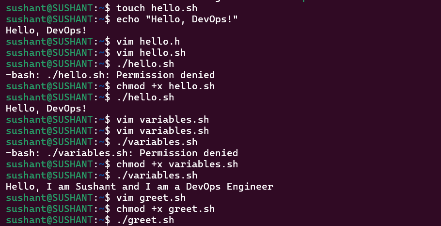

# Day 16 — Shell Scripting

## Objective

Build the fundamentals needed for Bash automation: shebangs, variables, input, conditions, and command execution.

## Task 1 — First Script

### `hello.sh`

```bash
#!/bin/bash
echo "Hello, DevOps!"
```

Run:

```bash
chmod +x hello.sh
./hello.sh
```

Output:

```text
Hello, DevOps!
```

### What happens if the shebang is removed?

The shebang tells the operating system which interpreter should execute the script when it is run directly as `./hello.sh`. Without it, direct execution can fail with an `Exec format error` or depend on how the script is invoked. Running `bash hello.sh` explicitly still tells Bash to interpret the file.

## Task 2 — Variables

### `variables.sh`

```bash
#!/bin/bash
NAME="Sushant"
ROLE="DevOps Engineer"

echo "Hello, I am $NAME and I am a $ROLE"
```

Output:

```text
Hello, I am Sushant and I am a DevOps Engineer
```

### Single vs Double Quotes

```bash
NAME="Sushant"

echo '$NAME'
echo "$NAME"
```

Output:

```text
$NAME
Sushant
```

**Learning:** Double quotes allow variable expansion. Single quotes preserve the text literally.

## Task 3 — User Input

### `greet.sh`

```bash
#!/bin/bash
read -p "Enter your name: " NAME
read -p "Enter your favourite tool: " TOOL

echo "Hello $NAME, your favourite tool is $TOOL"
```

Example run:

```text
Hello Sushant, your favourite tool is Docker
```



**Learning:** `read` captures user input and stores it in a variable.

## Task 4 — If-Else Conditions

### `check_number.sh`

```bash
#!/bin/bash
read -p "Enter a number: " NUMBER

if [ "$NUMBER" -gt 0 ]; then
    echo "Positive"
elif [ "$NUMBER" -lt 0 ]; then
    echo "Negative"
else
    echo "Zero"
fi
```


The script uses `-gt` and `-lt` for integer comparisons.

### `file_check.sh`

```bash
#!/bin/bash
read -p "Enter filename: " FILE

if [ -f "$FILE" ]; then
    echo "$FILE exists."
else
    echo "$FILE does not exist."
fi
```


`-f` checks whether the specified path exists and is a regular file.

## Task 5 — Combine It All

### `server_check.sh`

```bash
#!/bin/bash
SERVICE="nginx"

read -p "Do you want to check the status? (y/n): " ANSWER

if [ "$ANSWER" = "y" ]; then
    if systemctl is-active --quiet "$SERVICE"; then
        echo "$SERVICE is active."
    else
        echo "$SERVICE is not active."
    fi
elif [ "$ANSWER" = "n" ]; then
    echo "Skipped."
else
    echo "Invalid choice."
fi
```


The script uses a variable for the service name, accepts user input, applies an `if/elif/else` decision, and calls `systemctl` to determine the service state.

## Scripts Created

```text
hello.sh
variables.sh
greet.sh
check_number.sh
file_check.sh
server_check.sh
```

Make scripts executable:

```bash
chmod +x *.sh
```

Run them individually:

```bash
./hello.sh
./variables.sh
./greet.sh
./check_number.sh
./file_check.sh
./server_check.sh
```

## Key Syntax

### Shebang

```bash
#!/bin/bash
```

Defines Bash as the interpreter for direct script execution.

### Variable

```bash
NAME="Sushant"
echo "$NAME"
```

### Input

```bash
read -p "Enter name: " NAME
```

### Condition

```bash
if [ condition ]; then
    command
elif [ condition ]; then
    command
else
    command
fi
```

### File Test

```bash
if [ -f "$FILE" ]; then
    echo "File exists"
fi
```

## What I Learned

- The **shebang** determines which interpreter should execute a script when it is launched directly.
- Bash variables, echo, and read provide the basic building blocks for passing and displaying data.
- if/elif/else allows scripts to make decisions based on numbers, strings, file existence, command results, or service state.

## DevOps Connection

Shell scripting becomes useful when repetitive Linux operations need to be automated. These fundamentals are the foundation for scripts used in **server checks, deployments, log collection, CI/CD jobs, health checks, and operational troubleshooting**.

Learning flow could be like as per below:

```text
Shebang
   ↓
Variables
   ↓
User Input
   ↓
Conditions
   ↓
Commands
   ↓
Automation
```
