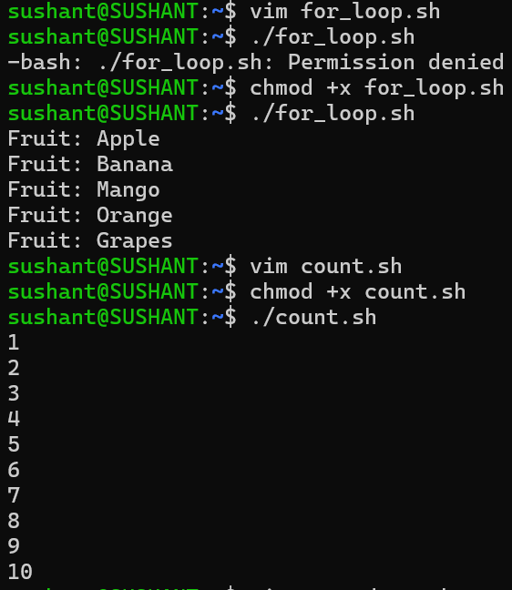
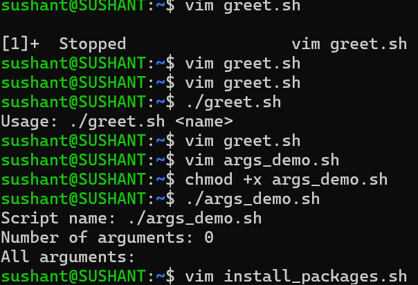
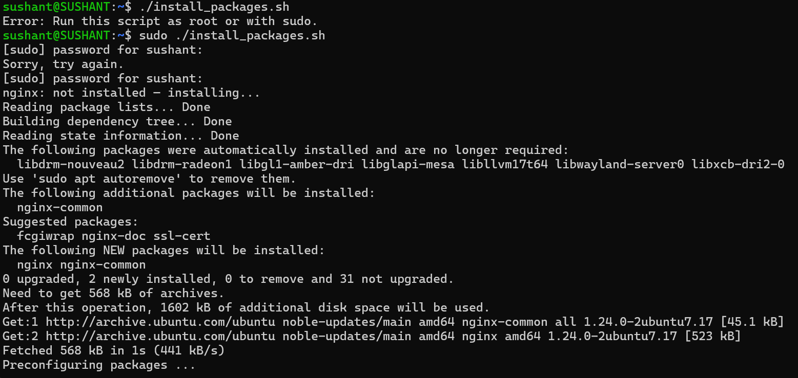

# Day 17 — Shell Scripting

## Objective
Build on Day 16 by using loops, command-line arguments, package installation, and basic error handling.

## Task 1 — For Loops

### `for_loop.sh`
```bash
#!/bin/bash
FRUITS=("Apple" "Banana" "Mango" "Orange" "Grapes")
for fruit in "${FRUITS[@]}"; do
    echo "Fruit: $fruit"
done
```
Run:
```bash
./for_loop.sh
```


Learning: A `for` loop is useful for processing a known list of values.

### `count.sh`
```bash
#!/bin/bash
for ((i=1; i<=10; i++)); do
    echo "$i"
done
```


Learning: A C-style `for` loop is useful for numeric sequences.

## Task 2 — While Loop

### `countdown.sh`
```bash
#!/bin/bash
read -p "Enter a number: " NUMBER
while [ "$NUMBER" -ge 0 ]; do
    echo "$NUMBER"
    NUMBER=$((NUMBER - 1))
done
echo "Done!"
```

Learning: A `while` loop continues while its condition is true. The loop variable must change to avoid an infinite loop.

## Task 3 — Command-Line Arguments

### `greet.sh`
```bash
#!/bin/bash
if [ "$#" -lt 1 ]; then
    echo "Usage: ./greet.sh <name>"
    exit 1
fi
echo "Hello, $1!"
```
Run:
```bash
./greet.sh Sushant
```



### `args_demo.sh`
```bash
#!/bin/bash
echo "Script name: $0"
echo "Number of arguments: $#"
echo "All arguments: $@"
```
Run:
```bash
./args_demo.sh Docker Kubernetes AWS
```


### Argument Reference
- `$0` — script name
- `$1` — first argument
- `$2` — second argument
- `$#` — number of arguments
- `$@` — all arguments

## Task 4 — Install Packages via Script

### `install_packages.sh`
```bash
#!/bin/bash
if [ "$EUID" -ne 0 ]; then
    echo "Error: Run this script as root or with sudo."
    exit 1
fi

PACKAGES=(nginx curl wget)

if command -v apt-get >/dev/null 2>&1; then
    PM=apt-get
elif command -v dnf >/dev/null 2>&1; then
    PM=dnf
elif command -v yum >/dev/null 2>&1; then
    PM=yum
else
    echo "Error: No supported package manager found."
    exit 1
fi

for package in "${PACKAGES[@]}"; do
    if command -v "$package" >/dev/null 2>&1; then
        echo "$package: already installed — skipping."
    else
        echo "$package: not installed — installing..."
        "$PM" install -y "$package" || {
            echo "Error: Failed to install $package."
            exit 1
        }
    fi
done
```
Run on the lab machine:
```bash
sudo ./install_packages.sh
```


The script checks root privileges, detects a supported package manager, skips installed packages, and installs missing packages. Do not run it on a production host without reviewing the package changes first.

## Task 5 — Error Handling

### `safe_script.sh`
```bash
#!/bin/bash
set -e

TEST_DIR=/tmp/devops-test
TEST_FILE="$TEST_DIR/test.txt"

mkdir "$TEST_DIR" || echo "Directory already exists."
cd "$TEST_DIR" || { echo "Error: Could not enter $TEST_DIR"; exit 1; }
touch "$TEST_FILE" || { echo "Error: Could not create $TEST_FILE"; exit 1; }

echo "Safe script completed successfully."
echo "Created: $TEST_FILE"
```

Run:
```bash
./safe_script.sh
```
Verify:
```bash
ls -l /tmp/devops-test
```

`set -e` makes Bash exit when a command fails, subject to Bash's normal exception rules. `||` lets the script provide a fallback action or controlled error message.

## Scripts Created
```text
for_loop.sh
count.sh
countdown.sh
greet.sh
args_demo.sh
install_packages.sh
safe_script.sh
```

Make them executable:
```bash
chmod +x *.sh
```

## Key Bash Concepts

### For Loop
```bash
for item in "${items[@]}"; do
    echo "$item"
done
```

### While Loop
```bash
while [ condition ]; do
    command
done
```

### Exit Status
```bash
echo $?
```
`0` normally means success; a non-zero value indicates failure.

### Root Check
```bash
if [ "$EUID" -ne 0 ]; then
    echo "Run as root"
    exit 1
fi
```

## What I Learned
- Loops remove repetitive commands and make automation scalable.
- Command-line arguments make scripts reusable for different inputs and environments.
- Error handling prevents scripts from blindly continuing after important operations fail.


Key takeaway: A useful DevOps script handles both the happy path and the failure path.
