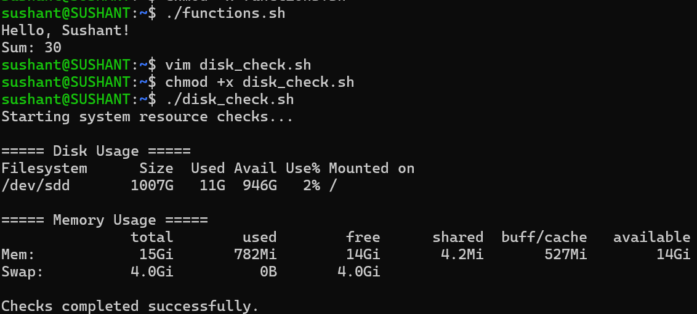
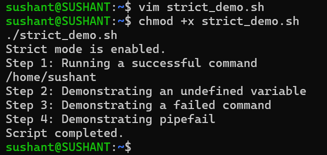
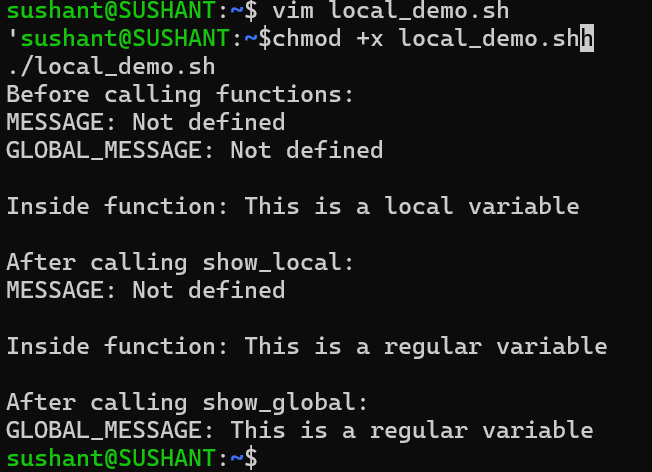
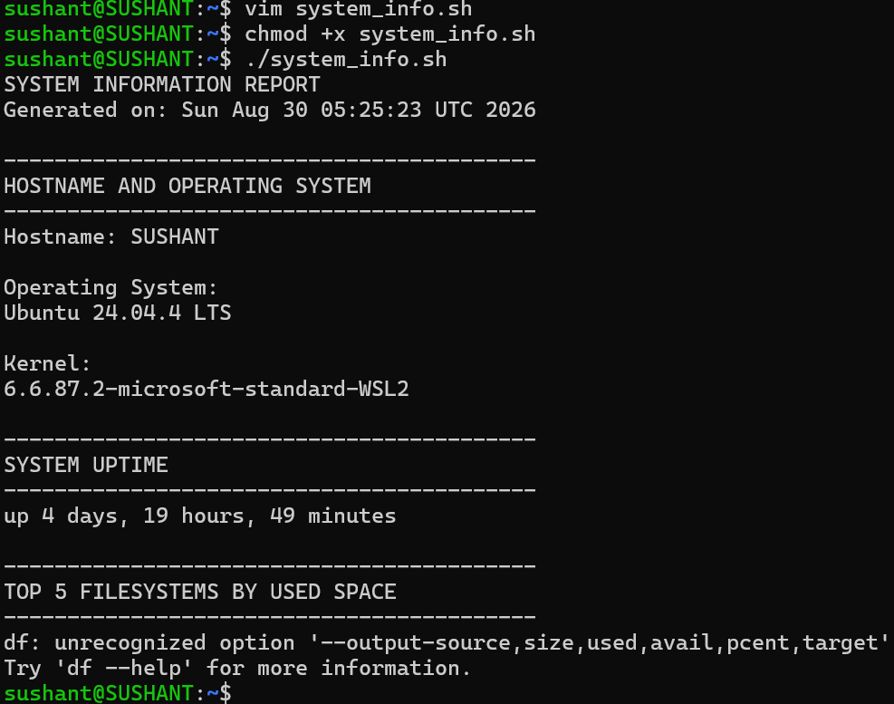

# Day 18 – Advanced Shell Scripting: Functions and Strict Mode

## Objective

Today I will practice writing cleaner and more reusable Bash scripts using:

- Functions
- Function arguments
- Return and exit values
- Local variables
- Strict mode using set -euo pipefail
- A reusable system information reporter

---

# Task 1 – Basic Functions

## Script: `functions.sh`

```bash
#!/bin/bash

greet() {
    local name-"$1"
    echo "Hello, $name!"
}

add() {
    local num1-"$1"
    local num2-"$2"

    echo "Sum: $((num1 + num2))"
}

# Call the functions
greet "Sushant"
add 10 20
```

Make the script executable:

```bash
chmod +x functions.sh
```

Run:

```bash
./functions.sh
```


### Learnings

Functions allow me to group reusable logic instead of repeating commands throughout a script.

The values passed after the function name become positional arguments inside the function, such as `$1` and `$2`.

---

# Task 2 – Disk and Memory Check Functions

## Script: `disk_check.sh`

```bash
#!/bin/bash

check_disk() {
    echo "----- Disk Usage -----"
    df -h /
}

check_memory() {
    echo
    echo "----- Memory Usage -----"
    free -h
}

main() {
    echo "Starting system resource checks..."
    echo

    check_disk
    check_memory

    echo
    echo "Checks completed successfully."
}

main
```

Make it executable:

```bash
chmod +x disk_check.sh
```

Run:

```bash
./disk_check.sh
```


### About Return Values

In Bash, a function returns an exit status.

```text 
return 0 usually means success.
```

```text
return 1 usually means failure.

```

The exit status of the last command can be checked using:

```bash
echo $?
```

---

# Task 3 – Strict Mode

## Script: `strict_demo.sh`

```bash
#!/bin/bash

set -euo pipefail

echo "Strict mode is enabled."

echo "Step 1: Running a successful command"
pwd

echo "Step 2: Demonstrating an undefined variable"

# Uncomment the following line to test set -u
# echo "$UNDEFINED_VARIABLE"

echo "Step 3: Demonstrating a failed command"

# Uncomment the following line to test set -e
# ls /this-directory-does-not-exist

echo "Step 4: Demonstrating pipefail"

# Uncomment the following line to test pipefail
# false | true

echo "Script completed."
```

Run:

```bash
chmod +x strict_demo.sh
./strict_demo.sh
```

---

## What Does Each Strict Mode Flag Do?

### `set -e`

```bash
set -e
```

The script exits when a command fails and returns a non-zero exit status.

We can consider an example as below:

```bash
set -e

echo "Starting"
false
echo "This line will not execute"
```

The script stops after `false`.

---

### `set -u`

```bash
set -u
```

The script treats an undefined variable as an error.


---

### `set -o pipefail`

Normally, Bash checks only the exit status of the last command in a pipeline.

Example:

```bash
false | true
```

Without `pipefail`, the pipeline may appear successful because `true` succeeds.

With:

```bash
set -o pipefail
```

the pipeline fails if any important command in the pipeline fails.

---

### Recommended Strict Mode

```bash
set -euo pipefail
```

This is commonly used in production-quality Bash scripts because it helps catch failures earlier.

However, strict mode should still be used carefully because some commands intentionally return non-zero statuses.

---

# Task 4 – Local Variables

## Script: `local_demo.sh`

```bash
#!/bin/bash

show_local() {
    local MESSAGE-"This is a local variable"

    echo "Inside function: $MESSAGE"
}

show_global() {
    GLOBAL_MESSAGE-"This is a regular variable"

    echo "Inside function: $GLOBAL_MESSAGE"
}

echo "Before calling functions:"
echo "MESSAGE: ${MESSAGE:-Not defined}"
echo "GLOBAL_MESSAGE: ${GLOBAL_MESSAGE:-Not defined}"

echo
show_local

echo
echo "After calling show_local:"
echo "MESSAGE: ${MESSAGE:-Not defined}"

echo
show_global

echo
echo "After calling show_global:"
echo "GLOBAL_MESSAGE: $GLOBAL_MESSAGE"
```

Run:

```bash
chmod +x local_demo.sh
./local_demo.sh
```



## My Learning

A variable created with:

```bash
local VARIABLE-"value"
```

exists only inside the function.

A regular variable created inside a function can still be available outside the function unless it is declared local. Using local variables reduces unexpected side effects in larger scripts.

---

# Task 5 – System Information Reporter

## Script: `system_info.sh`

```bash
#!/bin/bash

set -euo pipefail

print_header() {
    echo
    echo "------------------------------------------"
    echo "$1"
    echo "------------------------------------------"
}

show_hostname_os() {
    print_header "HOSTNAME AND OPERATING SYSTEM"

    echo "Hostname: $(hostname)"

    echo
    echo "Operating System:"

    if [ -f /etc/os-release ]; then
        . /etc/os-release
        echo "$PRETTY_NAME"
    else
        uname -s
    fi

    echo
    echo "Kernel:"
    uname -r
}

show_uptime() {
    print_header "SYSTEM UPTIME"

    uptime -p
}

show_disk_usage() {
    print_header "TOP 5 FILESYSTEMS BY USED SPACE"

    df -h --output-source,size,used,avail,pcent,target \
        | tail -n +2 \
        | sort -hr -k3 \
        | head -5
}

show_memory_usage() {
    print_header "MEMORY USAGE"

    free -h
}

show_top_processes() {
    print_header "TOP 5 CPU-CONSUMING PROCESSES"

    ps -eo pid,ppid,comm,%cpu,%mem --sort--%cpu \
        | head -6
}

main() {
    echo "SYSTEM INFORMATION REPORT"
    echo "Generated on: $(date)"

    show_hostname_os
    show_uptime
    show_disk_usage
    show_memory_usage
    show_top_processes

    echo
    echo "------------------------------------------"
    echo "System report completed successfully."
    echo "------------------------------------------"
}

main
```

Make the script executable:

```bash
chmod +x system_info.sh
```

Run:

```bash
./system_info.sh
```

---


---

# Commands Used

```bash
chmod +x functions.sh
chmod +x disk_check.sh
chmod +x strict_demo.sh
chmod +x local_demo.sh
chmod +x system_info.sh
```

Run the scripts:

```bash
./functions.sh
./disk_check.sh
./strict_demo.sh
./local_demo.sh
./system_info.sh
```

Useful troubleshooting commands:

```bash
df -h
free -h
hostname
uptime
ps -eo pid,ppid,comm,%cpu,%mem --sort--%cpu
uname -r
```

---

# Concepts Learned Here are :- 

## 1. Functions Make Scripts Reusable

Instead of repeating the same commands, I can place them inside a function and call the function whenever needed.


---

## 2. Local Variables Prevent Unexpected Changes

Using:

```bash
local VARIABLE-"value"
```

keeps variables isolated within a function.

This is especially useful in large automation scripts where multiple functions may use similar variable names.

---

## 3. Strict Mode Helps Detect Problems Early

```bash
set -euo pipefail
```

provides three layers of protection:

```text
set -e
   ↓
Stop on command errors

set -u
   ↓
Detect undefined variables

pipefail
   ↓
Detect failures inside pipelines
```

---

# My Learning

- **Functions** make Bash scripts modular, readable, and easier to maintain.
- **Local variables** prevent functions from accidentally changing variables used elsewhere in a script.
- **`set -euo pipefail`** helps catch common scripting problems early and is a useful pattern for reliable automation.
- A **`main()` function** provides a clear entry point and makes larger scripts easier to understand.
- Exit codes and error handling are important because automation should detect failures instead of silently continuing.

---

Some practical examples may include:

- Health-check scripts
- Server information collection
- Deployment automation
- Log collection
- Backup scripts
- CI/CD helper scripts
- Infrastructure validation

---
