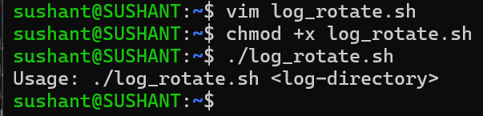
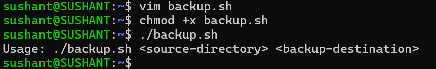
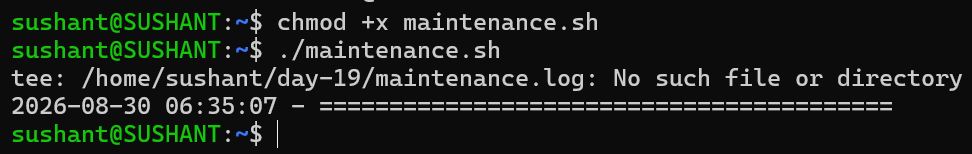

# Day 19 – Shell Scripting Mini Projects

## Our Core Objective for today

Today I applied the Bash scripting concepts learned during Days 16–18 to practical DevOps maintenance tasks.

The projects will focus on:

- Log rotation
- Server backups
- Error handling
- Functions and reusable code
- Strict mode using `set -euo pipefail`
- Scheduled automation using cron


# Project 1 – Log Rotation Script

## Script: `log_rotate.sh`

```bash
#!/bin/bash

set -euo pipefail

if [ "$#" -ne 1 ]; then
    echo "Usage: $0 <log-directory>"
    exit 1
fi

LOG_DIR="$1"

if [ ! -d "$LOG_DIR" ]; then
    echo "Error: Directory '$LOG_DIR' does not exist."
    exit 1
fi

compress_old_logs() {
    local count=0

    while IFS= read -r -d '' logfile; do
        echo "Compressing: $logfile"
        gzip "$logfile"
        ((count+=1))
    done < <(find "$LOG_DIR" -type f -name "*.log" -mtime +7 -print0)

    echo "$count log file(s) compressed."
}

delete_old_archives() {
    local count=0

    while IFS= read -r -d '' archive; do
        echo "Deleting: $archive"
        rm -f "$archive"
        ((count+=1))
    done < <(find "$LOG_DIR" -type f -name "*.gz" -mtime +30 -print0)

    echo "$count compressed archive(s) deleted."
}

main() {
    echo "========================================="
    echo "Log Rotation Started: $(date)"
    echo "Target Directory: $LOG_DIR"
    echo "========================================="

    compress_old_logs
    delete_old_archives

    echo "Log rotation completed successfully."
}

main
```

## What the Script Does

1. Accepts a log directory as an argument.
2. Checks whether the directory exists.
3. Finds `.log` files older than 7 days.
4. Compresses old logs using `gzip`.
5. Finds `.gz` archives older than 30 days.
6. Deletes old archives.
7. Prints the number of compressed and deleted files.

## Output



---

# Project 2 – Server Backup Script

## Script: `backup.sh`

```bash
#!/bin/bash

set -euo pipefail

if [ "$#" -ne 2 ]; then
    echo "Usage: $0 <source-directory> <backup-destination>"
    exit 1
fi

SOURCE_DIR="$1"
BACKUP_DIR="$2"

if [ ! -d "$SOURCE_DIR" ]; then
    echo "Error: Source directory '$SOURCE_DIR' does not exist."
    exit 1
fi

mkdir -p "$BACKUP_DIR"

create_backup() {
    local timestamp
    local archive_name
    local source_parent
    local source_name

    timestamp=$(date +%Y-%m-%d_%H-%M-%S)
    archive_name="backup-${timestamp}.tar.gz"

    source_parent=$(dirname "$SOURCE_DIR")
    source_name=$(basename "$SOURCE_DIR")

    echo "Creating backup..."

    tar -czf "$BACKUP_DIR/$archive_name" \
        -C "$source_parent" \
        "$source_name"

    echo "$BACKUP_DIR/$archive_name"
}

verify_backup() {
    local archive="$1"

    if [ -f "$archive" ]; then
        echo "Backup created successfully."
        echo "Archive: $(basename "$archive")"
        echo "Size: $(du -h "$archive" | cut -f1)"
    else
        echo "Error: Backup archive was not created."
        exit 1
    fi
}

cleanup_old_backups() {
    echo "Removing backups older than 14 days..."

    find "$BACKUP_DIR" \
        -type f \
        -name "backup-*.tar.gz" \
        -mtime +14 \
        -print \
        -delete
}

main() {
    echo "========================================="
    echo "Backup Started: $(date)"
    echo "Source: $SOURCE_DIR"
    echo "Destination: $BACKUP_DIR"
    echo "========================================="

    ARCHIVE=$(create_backup)

    verify_backup "$ARCHIVE"

    cleanup_old_backups

    echo "Backup completed successfully."
}

main
```

## What the Script will do

- Takes a source directory and backup destination.
- Creates the destination if it does not exist.
- Creates a timestamped `.tar.gz` archive.
- Verifies that the archive was created.
- Displays the archive name and size.
- Deletes backups older than 14 days.

## Sample Output


---

# Project 3 – Cron Scheduling

## Check Existing Cron Jobs

```bash
crontab -l
```

To edit scheduled tasks:

```bash
crontab -e
```

## Cron Syntax

```text
* * * * * command

│ │ │ │ │
│ │ │ │ └── Day of week
│ │ │ └──── Month
│ │ └────── Day of month
│ └──────── Hour
└────────── Minute
```

## Log Rotation – Daily at 2 AM

```cron
0 2 * * * /home/sushant/2026/day-19/log_rotate.sh /var/log/myapp >> /home/sushant/2026/day-19/log_rotate_cron.log 2>&1
```

## Backup – Every Sunday at 3 AM

```cron
0 3 * * 0 /home/sushant/2026/day-19/backup.sh /home/sushant/data /home/sushant/backups >> /home/sushant/2026/day-19/backup_cron.log 2>&1
```

## Health Check – Every 5 Minutes

```cron
*/5 * * * * /home/sushant/2026/day-19/health_check.sh >> /home/sushant/2026/day-19/health_check.log 2>&1
```

The `2>&1` redirects errors into the same log file as standard output. This is useful because cron jobs otherwise run without an interactive terminal.

---

# Project 4 – Scheduled Maintenance

## Script: `maintenance.sh`

```bash
#!/bin/bash

set -euo pipefail

SCRIPT_DIR="$(cd "$(dirname "${BASH_SOURCE[0]}")" && pwd)"

MAINTENANCE_LOG="$HOME/day-19/maintenance.log"

LOG_DIRECTORY="/var/log/myapp"
SOURCE_DIRECTORY="/home/sushant/data"
BACKUP_DIRECTORY="/home/sushant/backups"

log_message() {
    echo "$(date '+%Y-%m-%d %H:%M:%S') - $1" | tee -a "$MAINTENANCE_LOG"
}

run_log_rotation() {
    log_message "Starting log rotation."

    "$SCRIPT_DIR/log_rotate.sh" "$LOG_DIRECTORY"

    log_message "Log rotation completed."
}

run_backup() {
    log_message "Starting backup."

    "$SCRIPT_DIR/backup.sh" \
        "$SOURCE_DIRECTORY" \
        "$BACKUP_DIRECTORY"

    log_message "Backup completed."
}

main() {
    log_message "========================================="
    log_message "Daily maintenance started."

    run_log_rotation
    run_backup

    log_message "Daily maintenance completed successfully."
    log_message "========================================="
}

main
```



## Cron Entry – Run Daily at 1 AM

```cron
0 1 * * * /home/sushant/2026/day-19/maintenance.sh >> /home/sushant/2026/day-19/maintenance_cron.log 2>&1
```

---

# Commands Used

```bash
chmod +x log_rotate.sh
chmod +x backup.sh
chmod +x maintenance.sh
chmod +x health_check.sh
```

Run log rotation:

```bash
./log_rotate.sh ~/day-19/logs
```

Run backup:

```bash
./backup.sh ~/day-19/source-data ~/day-19/backups
```

Run maintenance:

```bash
./maintenance.sh
```

Check cron jobs:

```bash
crontab -l
```

Edit cron jobs:

```bash
crontab -e
```

Useful verification commands:

```bash
ls -lh ~/day-19/backups
tar -tzf backup-file.tar.gz
find ~/day-19/logs -type f
```

---

# What I Learned

- Functions make automation scripts easier to organize and reuse.
- `set -euo pipefail` helps scripts fail early when unexpected errors occur.
- Input validation is important before performing operations on files and directories.
- `find` is useful for implementing retention policies based on file age.
- `tar` and `gzip` can automate server backup creation.
- Cron allows Linux maintenance tasks to run automatically on a schedule.
- Logging script output is important because scheduled jobs usually run without an interactive terminal.

---

## My Takeaways would be 

The goal of shell scripting is not simply to automate commands.

A useful DevOps automation script should validate inputs, handle errors, produce useful logs, clean up old data, and be safe enough to run repeatedly through a scheduler such as cron.