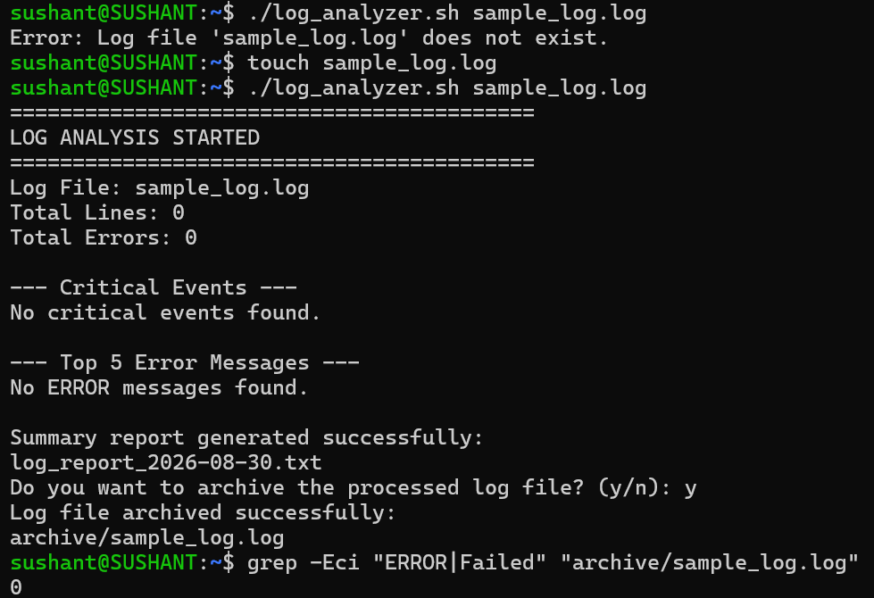

# Day 20 – Log Analyzer Automation

## Objective

The objective of this task was to create a Bash script that can analyze a log file automatically and generate a daily summary report.

The script accepts a log file as input, validates the file, counts errors, identifies critical events, finds the most common error messages, and generates a report with the analysis results.

---

# Script Created

- `log_analyzer.sh`
- `log_report_<date>.txt`

The script was tested using:

```bash
sample_log.log
```

---

# Input Validation

The script first checks whether a log file was provided as a command-line argument.

```bash
if [ "$#" -ne 1 ]; then
    echo "Usage: $0 <log_file>"
    exit 1
fi
```

It then checks whether the provided file actually exists.

```bash
if [ ! -f "$LOG_FILE" ]; then
    echo "Error: Log file '$LOG_FILE' does not exist."
    exit 1
fi
```

This prevents the script from continuing with invalid input.

---

# Error Count

The following command counts lines containing either `ERROR` or `Failed`.

```bash
grep -Eci "ERROR|Failed" "$LOG_FILE"
```

The `-E` option enables extended patterns, `-i` makes the search case-insensitive, and `-c` counts matching lines.

The result is stored in a variable and displayed on the console.

---

# Critical Events

Critical events are identified using:

```bash
grep -ni "CRITICAL" "$LOG_FILE"
```

The `-n` option displays the line number, while `-i` allows case-insensitive matching.

The script formats the output as:

```text
Line 42: 2026-08-30 10:15:23 CRITICAL Disk space below threshold
```

This makes it easier to locate important events inside a large log file.

---

# Top 5 Error Messages

The script extracts lines containing `ERROR`, removes the timestamp and log level, and then counts repeated messages.

```bash
grep -i "ERROR" "$LOG_FILE" \
    | sed -E 's/^.*ERROR[[:space:]]*//' \
    | sort \
    | uniq -c \
    | sort -rn \
    | head -5
```

The processing flow is:

1. `grep` extracts ERROR entries.
2. `sed` removes the text before the error message.
3. `sort` groups identical messages together.
4. `uniq -c` counts repeated messages.
5. `sort -rn` sorts the results from highest to lowest.
6. `head -5` displays the top five.



---

# Summary Report

The report is generated using the current date.

```bash
ANALYSIS_DATE=$(date +"%Y-%m-%d")
REPORT_FILE="log_report_${ANALYSIS_DATE}.txt"
```

The generated report includes:

- Date of analysis
- Log file name
- Total lines processed
- Total error count
- Top five error messages
- Critical events with line numbers


---

# Optional Archive Feature

The script also provides an option to archive the processed log.

The archive directory is created if it does not already exist.

```bash
mkdir -p archive
```

The processed log is then moved into the directory.

```bash
mv "$LOG_FILE" "archive/$BASENAME"
```

This helps keep processed logs separate from new logs.

---

# Commands and Tools Used

| Command | Purpose |
|---|---|
| `grep` | Search for ERROR, Failed, and CRITICAL events |
| `wc -l` | Count total lines in the log file |
| `sed` | Extract the actual error message |
| `sort` | Sort error messages |
| `uniq -c` | Count repeated messages |
| `head` | Display the top five results |
| `cut` | Separate line numbers from log messages |
| `date` | Generate the report date |
| `mkdir -p` | Create the archive directory |
| `mv` | Move processed logs into the archive |

---

# Way of Execution

Generate the sample log:

```bash
./log_generator.sh sample_log.log 500
```

Make the analyzer executable:

```bash
chmod +x log_analyzer.sh
```

Run the analyzer:

```bash
./log_analyzer.sh sample_log.log
```

# What I Learned

1. Bash can automate repetitive log analysis tasks using standard Linux commands such as `grep`, `sed`, `sort`, and `uniq`.

2. Combining multiple commands through pipelines makes it possible to filter, transform, count, and summarize large amounts of log data efficiently.

3. Input validation and error handling are important because automation scripts should fail safely when files or arguments are missing.

4. Generating timestamped reports makes daily operational analysis easier and helps maintain historical records.

5. Archiving processed logs is a useful operational practice because it separates completed work from logs that still need to be analyzed.